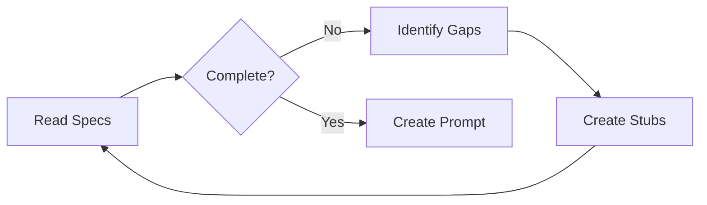

# AI Development Methodology - Framtidsbygget

**Version:** 1.0  
**Status:** AI Excellence Framework  
**Purpose:** Eliminate AI hallucination risks and maximize development success rate

---

## Executive Summary

This methodology provides a systematic approach to AI-driven development for Framtidsbygget, addressing the critical risk of "AI Hallucination in Game Mechanics" (60% probability). By implementing structured prompts, quality gates, and continuous improvement processes, we aim to achieve >90% AI success rate with <10% human modification required.

## Table of Contents

1. [AI Success Matrix](#ai-success-matrix)
2. [Prompt Engineering Best Practices](#prompt-engineering-best-practices)
3. [Development Workflow](#development-workflow)
4. [Quality Control Integration](#quality-control-integration)
5. [Iteration & Improvement Framework](#iteration-improvement-framework)

---

## AI Success Matrix

### Component Success Probability Analysis

| Component Category | Component Name | AI Success Rate | Complexity Factors | Risk Level |
|-------------------|----------------|-----------------|-------------------|------------|
| **Framework Components** | | | | |
| Navigation | MainDashboard.jsx | 9/10 | Simple layout, clear props | Low |
| Data Display | Scoreboard.jsx | 9/10 | Pure presentational | Low |
| User Feedback | ResultModal.jsx | 9/10 | Well-defined states | Low |
| Visualization | MapView.jsx | 8/10 | SVG complexity | Medium |
| Complex UI | DigitalaKompassen.jsx | 7/10 | D3.js integration | Medium |
| Flow Control | OnboardingFlow.jsx | 8/10 | State machine logic | Low |
| Celebration | FinaleSequence.jsx | 8/10 | Animation sequences | Low |
| **Game Modules** | | | | |
| Logic Puzzle | PuzzleGameModule.jsx | 8/10 | Drag-drop, validation | Medium |
| Dialogue | WelfareGameModule.jsx | 7/10 | Branching dialogue | Medium |
| Resource Mgmt | CompetenceGameModule.jsx | 7/10 | Card mechanics | Medium |
| Real-time | ConnectivityGameModule.jsx | 5/10 | Crisis management | **High** |
| Simulation | EcosystemGameModule.jsx | 6/10 | Complex calculations | High |
| **Integration** | | | | |
| State Bridge | GameCanvasWrapper | 6/10 | PixiJS-React bridge | High |
| State Mgmt | Global State | 7/10 | 3-layer complexity | Medium |
| Performance | Optimization | 6/10 | Frame rate targets | High |

### Risk Categorization

#### Low Risk (8-10/10 Success Rate)
- Pure React components with clear specifications
- Simple state management requirements
- Well-defined UI/UX patterns
- Minimal third-party dependencies

#### Medium Risk (6-7/10 Success Rate)
- Components with complex state logic
- Third-party library integrations (D3.js, PixiJS)
- Multi-step user flows
- Performance-sensitive operations

#### High Risk (5/10 or below)
- Real-time game mechanics
- Complex PixiJS integrations
- Performance-critical rendering
- Multi-system state synchronization

---

## Prompt Engineering Best Practices

### Core Principles for Framtidsbygget

#### 1. Context Maximization
```markdown
# OPTIMAL PROMPT STRUCTURE

## ROLE DEFINITION
You are implementing [Component Name] for Framtidsbygget, an educational React + PixiJS game.

## EXACT SPECIFICATIONS
- Component Type: [Framework/Game Module]
- Dependencies: [List all required imports]
- State Requirements: [Exact state shape]
- Props Interface: [TypeScript-like definition]
- Performance Targets: [FPS, memory limits]

## INTEGRATION CONTEXT
- Parent Component: [Name and relationship]
- Child Components: [List with props passed]
- State Management: [How it connects to global state]
- Event Flow: [User interactions and system events]

## IMPLEMENTATION REQUIREMENTS
1. [Specific requirement with acceptance criteria]
2. [Specific requirement with acceptance criteria]
...

## VALIDATION CRITERIA
- [ ] Requirement 1 met
- [ ] Requirement 2 met
- [ ] Performance target achieved
- [ ] Accessibility standards followed
```

#### 2. Ambiguity Elimination

**❌ AVOID AMBIGUOUS SPECIFICATIONS:**
```
"Create a game component that handles user interactions"
```

**✅ USE PRECISE SPECIFICATIONS:**
```
Create PuzzleGameModule.jsx that:
1. Renders a 6x4 grid of draggable nodes
2. Validates connections through central hub only
3. Updates budget on each connection (cost: 50kr)
4. Triggers completion when all nodes connected
5. Maintains 60fps during drag operations
```

#### 3. Example-Driven Development

**PROVIDE WORKING EXAMPLES:**
```javascript
// EXAMPLE: Expected drag-drop behavior
const handleNodeDrag = (nodeId, position) => {
  // Validate grid snapping
  const snappedPos = snapToGrid(position, GRID_SIZE);
  
  // Check connection validity
  if (isValidConnection(nodeId, snappedPos)) {
    updateNodePosition(nodeId, snappedPos);
    highlightValidTargets(nodeId);
  } else {
    showInvalidFeedback();
  }
};
```

### Component-Specific Prompt Patterns

#### Pattern 1: React Component Prompts
```markdown
# REACT COMPONENT PROMPT TEMPLATE

Create [ComponentName].jsx with these specifications:

## Component Structure
- Functional component using hooks
- Props: {exact prop types with descriptions}
- State: {local state requirements}
- Context: Uses {GameStateContext/other contexts}

## Visual Design
- Layout: {specific layout requirements}
- Styling: Use className="{specific classes}"
- Responsive: {breakpoint behaviors}
- Animations: {transition specifications}

## Behavior
- User Interactions: {click/hover/drag behaviors}
- State Updates: {when and how state changes}
- Side Effects: {API calls, timers, subscriptions}

## Integration
- Import from: {specific file paths}
- Export as: {default/named export}
- Used by: {parent components}
- Uses: {child components}

## Code Example
{Provide a minimal working example}

## Testing Requirements
- Renders without crashing
- {Specific test cases}
```

#### Pattern 2: PixiJS Game Module Prompts
```markdown
# PIXIJS GAME MODULE PROMPT TEMPLATE

Create [GameName]Pixi.js extending BasePixiGame:

## Game Specifications
- Game Type: {puzzle/realtime/turnbased}
- Canvas Size: {width}x{height}
- Target FPS: {30/60}
- Mobile Support: {yes/no}

## Game Objects
1. {ObjectType}: 
   - Visual: {description}
   - Behavior: {interactions}
   - State: {properties}

## Game Logic
- Win Condition: {exact criteria}
- Lose Condition: {if applicable}
- Score Calculation: {formula}
- Difficulty Progression: {if applicable}

## State Management
- Initial State: {exact structure}
- State Updates: {events that trigger updates}
- State Validation: {rules}
- Save Points: {when to persist}

## Performance Requirements
- Max Sprites: {number}
- Texture Atlas: {yes/no}
- Object Pooling: {requirements}
- Memory Limit: {MB}

## Integration with React
- State Bridge Events: {list all events}
- Update Frequency: {ms}
- Cleanup Requirements: {what to destroy}
```

#### Pattern 3: Integration Prompts
```markdown
# INTEGRATION PROMPT TEMPLATE

Integrate [Component A] with [Component B]:

## Data Flow
- Direction: {A→B, B→A, bidirectional}
- Data Type: {exact structure}
- Update Trigger: {event/condition}
- Validation: {rules}

## State Synchronization
- Source of Truth: {which component owns state}
- Update Method: {props/context/bridge}
- Conflict Resolution: {strategy}

## Error Handling
- Possible Errors: {list}
- Recovery Strategy: {for each error}
- User Feedback: {how to show errors}

## Performance Considerations
- Update Frequency: {limit}
- Batching Strategy: {if needed}
- Memoization: {what to memoize}
```

---

## Development Workflow

### Phase 1: Specification Validation (Before AI)



#### Checklist:
- [ ] All props defined with types
- [ ] State structure documented
- [ ] Integration points identified
- [ ] Performance requirements clear
- [ ] Visual design specifications complete
- [ ] Test cases defined

### Phase 2: AI Development Process

```javascript
// STEP 1: Component Scaffolding
const promptStep1 = `
Create the basic structure for ${componentName}:
- Import statements
- Component declaration
- Props interface
- Return basic JSX structure
`;

// STEP 2: State Implementation
const promptStep2 = `
Add state management to ${componentName}:
- Local state with useState
- Context connections
- State update functions
`;

// STEP 3: Business Logic
const promptStep3 = `
Implement business logic for ${componentName}:
- Event handlers
- Validation functions
- Data transformations
`;

// STEP 4: Integration
const promptStep4 = `
Complete integration for ${componentName}:
- Connect to parent/child components
- Add error boundaries
- Implement loading states
`;
```

### Phase 3: Quality Validation

#### Automated Validation Script
```javascript
// validate-component.js
const validateComponent = async (componentPath) => {
  const results = {
    syntax: await validateSyntax(componentPath),
    props: await validateProps(componentPath),
    state: await validateStateManagement(componentPath),
    performance: await validatePerformance(componentPath),
    accessibility: await validateA11y(componentPath),
    tests: await validateTests(componentPath)
  };
  
  const score = calculateScore(results);
  return {
    passed: score >= 90,
    score,
    results,
    recommendations: generateRecommendations(results)
  };
};
```

### Phase 4: Iterative Improvement

```markdown
## Improvement Cycle

1. **Initial Generation**
   - AI creates component based on prompt
   - Automatic validation runs
   - Score: X/100

2. **Gap Analysis**
   - Identify failing requirements
   - Categorize issues (logic/style/performance)
   - Prioritize fixes

3. **Targeted Prompts**
   - Create specific fix prompts
   - "Fix the validation error in handleDragDrop function"
   - "Optimize the render method to achieve 60fps"

4. **Validation Loop**
   - Re-run validation
   - Compare scores
   - Continue until score >= 90
```

---

## Quality Control Integration

### Automatic Quality Gates

#### Gate 1: Syntax and Structure
```javascript
// quality-gates/syntax-validator.js
export const validateSyntax = (code) => {
  const checks = [
    checkImports(code),
    checkComponentStructure(code),
    checkHooksUsage(code),
    checkPropTypes(code)
  ];
  
  return {
    passed: checks.every(c => c.passed),
    details: checks
  };
};
```

#### Gate 2: Design System Compliance
```javascript
// quality-gates/design-validator.js
export const validateDesign = (component) => {
  const rules = {
    colors: checkColorUsage(component),
    spacing: checkSpacingSystem(component),
    typography: checkFontUsage(component),
    components: checkComponentLibrary(component),
    responsiveness: checkBreakpoints(component)
  };
  
  return evaluateRules(rules);
};
```

#### Gate 3: Performance Standards
```javascript
// quality-gates/performance-validator.js
export const validatePerformance = async (component) => {
  const metrics = await runPerformanceTest(component);
  
  return {
    fps: metrics.fps >= 60,
    memory: metrics.memory < 50_000_000, // 50MB
    renderTime: metrics.renderTime < 16, // ms
    bundleSize: metrics.bundleSize < 100_000 // 100KB
  };
};
```

#### Gate 4: Integration Compliance
```javascript
// quality-gates/integration-validator.js
export const validateIntegration = (component) => {
  return {
    stateManagement: checkStateIntegration(component),
    propsPassing: checkPropsContract(component),
    eventHandling: checkEventEmitters(component),
    errorBoundaries: checkErrorHandling(component)
  };
};
```

### Continuous Monitoring

```javascript
// monitoring/ai-success-tracker.js
class AISuccessTracker {
  constructor() {
    this.metrics = {
      componentsGenerated: 0,
      firstPassSuccess: 0,
      averageIterations: 0,
      timeToCompletion: [],
      commonErrors: new Map()
    };
  }
  
  trackGeneration(component, result) {
    this.metrics.componentsGenerated++;
    
    if (result.firstPass) {
      this.metrics.firstPassSuccess++;
    }
    
    this.metrics.timeToCompletion.push(result.duration);
    
    result.errors.forEach(error => {
      const count = this.metrics.commonErrors.get(error.type) || 0;
      this.metrics.commonErrors.set(error.type, count + 1);
    });
    
    this.generateReport();
  }
  
  generateReport() {
    return {
      successRate: (this.metrics.firstPassSuccess / this.metrics.componentsGenerated) * 100,
      averageTime: average(this.metrics.timeToCompletion),
      topErrors: Array.from(this.metrics.commonErrors.entries())
        .sort((a, b) => b[1] - a[1])
        .slice(0, 5)
    };
  }
}
```

---

## Iteration & Improvement Framework

### Feedback Collection System

```javascript
// feedback/prompt-effectiveness.js
class PromptEffectiveness {
  constructor() {
    this.prompts = new Map();
  }
  
  recordPromptResult(promptId, result) {
    const prompt = this.prompts.get(promptId) || {
      uses: 0,
      successes: 0,
      failures: [],
      averageQuality: 0
    };
    
    prompt.uses++;
    if (result.success) {
      prompt.successes++;
    } else {
      prompt.failures.push({
        reason: result.failureReason,
        component: result.component,
        timestamp: Date.now()
      });
    }
    
    prompt.averageQuality = 
      (prompt.averageQuality * (prompt.uses - 1) + result.quality) / prompt.uses;
    
    this.prompts.set(promptId, prompt);
  }
  
  getOptimizationSuggestions() {
    const suggestions = [];
    
    this.prompts.forEach((data, promptId) => {
      const successRate = data.successes / data.uses;
      
      if (successRate < 0.7) {
        suggestions.push({
          promptId,
          issue: 'Low success rate',
          successRate,
          commonFailures: this.analyzeFailures(data.failures),
          recommendation: this.generateRecommendation(data)
        });
      }
    });
    
    return suggestions;
  }
}
```

### A/B Testing Framework

```javascript
// testing/prompt-ab-test.js
class PromptABTest {
  constructor(componentType) {
    this.componentType = componentType;
    this.variants = new Map();
    this.results = [];
  }
  
  addVariant(id, prompt) {
    this.variants.set(id, {
      prompt,
      uses: 0,
      scores: []
    });
  }
  
  async runTest(iterations = 10) {
    for (let i = 0; i < iterations; i++) {
      for (const [id, variant] of this.variants) {
        const result = await this.testVariant(variant.prompt);
        variant.uses++;
        variant.scores.push(result.score);
        
        this.results.push({
          variantId: id,
          iteration: i,
          score: result.score,
          time: result.time,
          errors: result.errors
        });
      }
    }
    
    return this.analyzeResults();
  }
  
  analyzeResults() {
    const analysis = {};
    
    this.variants.forEach((data, id) => {
      analysis[id] = {
        averageScore: average(data.scores),
        consistency: standardDeviation(data.scores),
        bestScore: Math.max(...data.scores),
        worstScore: Math.min(...data.scores)
      };
    });
    
    return {
      winner: this.selectWinner(analysis),
      analysis,
      recommendation: this.generateRecommendation(analysis)
    };
  }
}
```

### Continuous Improvement Process

```markdown
## Weekly Improvement Cycle

### Monday: Metrics Review
- Review AI success rates from previous week
- Identify lowest performing component types
- Analyze common failure patterns

### Tuesday: Prompt Optimization
- Create prompt variants for problematic components
- Incorporate lessons learned
- Add new examples from successful implementations

### Wednesday-Thursday: A/B Testing
- Run parallel tests with prompt variants
- Collect performance metrics
- Validate quality scores

### Friday: Implementation & Documentation
- Deploy winning prompt variants
- Update prompt library
- Document new patterns discovered
- Share learnings with team
```

### Success Pattern Repository

```javascript
// patterns/success-patterns.js
class SuccessPatternRepository {
  constructor() {
    this.patterns = new Map();
  }
  
  addPattern(pattern) {
    const category = pattern.componentType;
    const patterns = this.patterns.get(category) || [];
    
    patterns.push({
      id: generateId(),
      description: pattern.description,
      prompt: pattern.prompt,
      code: pattern.generatedCode,
      score: pattern.qualityScore,
      metrics: pattern.performanceMetrics,
      tags: pattern.tags,
      createdAt: Date.now()
    });
    
    this.patterns.set(category, patterns);
  }
  
  getTopPatterns(category, limit = 5) {
    const patterns = this.patterns.get(category) || [];
    return patterns
      .sort((a, b) => b.score - a.score)
      .slice(0, limit);
  }
  
  searchPatterns(query) {
    const results = [];
    
    this.patterns.forEach((patterns, category) => {
      patterns.forEach(pattern => {
        if (this.matchesQuery(pattern, query)) {
          results.push({ ...pattern, category });
        }
      });
    });
    
    return results;
  }
}
```

---

## Implementation Checklist

### Phase 1: Foundation (Week 1)
- [ ] Create quality gate scripts
- [ ] Set up success tracking system
- [ ] Implement prompt template library
- [ ] Configure A/B testing framework

### Phase 2: Component Development (Weeks 2-3)
- [ ] Generate framework components (high success rate)
- [ ] Validate and iterate on each component
- [ ] Document successful patterns
- [ ] Build integration tests

### Phase 3: Game Modules (Weeks 4-5)
- [ ] Start with PuzzleGame (highest success probability)
- [ ] Implement progressive complexity
- [ ] Leave ConnectivityGame for last
- [ ] Continuous validation and improvement

### Phase 4: Optimization (Week 6)
- [ ] Analyze all metrics
- [ ] Optimize underperforming prompts
- [ ] Create final documentation
- [ ] Prepare for production deployment

---

## Success Metrics

### Target Metrics
- **First-Pass Success Rate**: >70%
- **Final Success Rate**: >90%
- **Human Modification Required**: <10%
- **Average Iterations to Success**: <3
- **Performance Compliance**: 100%
- **Accessibility Compliance**: 100%

### Measurement Methods
```javascript
const measureSuccess = () => {
  return {
    firstPassRate: (firstPassSuccesses / totalAttempts) * 100,
    finalRate: (finalSuccesses / totalAttempts) * 100,
    modificationRate: (humanEdits / totalLines) * 100,
    averageIterations: totalIterations / totalComponents,
    performanceCompliance: (performancePasses / totalComponents) * 100,
    accessibilityCompliance: (a11yPasses / totalComponents) * 100
  };
};
```

---

*Last Updated: 2025-06-20*  
*Methodology Version: 1.0*  
*Optimized for Framtidsbygget AI Development*