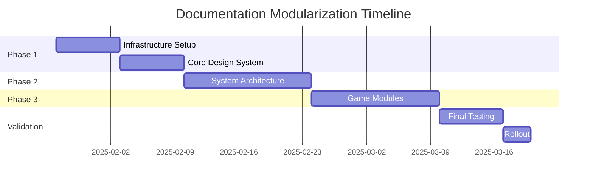

# Modular Documentation Rollout Roadmap

**Project:** Framtidsbygget Documentation Modularization  
**Timeline:** 6-8 weeks  
**Start Date:** 2025-01-27  
**Goal:** Convert all documentation to AI-optimized modular packages

---

## 📊 Executive Summary

Transform existing monolithic documentation (~150k+ tokens) into modular packages optimized for AI development. Target: 15-20 packages, each under 30k tokens, with clear dependencies and self-contained functionality.

**Key Benefits:**
- 80% reduction in AI context usage
- Faster development cycles
- Improved documentation quality
- Better team onboarding

---

## 🚀 Phase 1: Foundation (Week 1-2)
*Establish infrastructure and core packages*

### Week 1: Infrastructure Setup

**Packages to Create:**
1. **Documentation System (X1)** - Meta documentation
   - Package validation system ✅
   - AI navigation guide ✅
   - Package templates ✅
   - Token counting tools

2. **Development Tools (S5)** - Build and tooling
   - ESLint configuration
   - Prettier setup
   - Build scripts
   - Development environment

**Success Criteria:**
- Validation system operational
- First 2 packages validated
- Team trained on new structure

### Week 2: Core Design System

**Packages to Complete:**
1. **Remaining DS Packages:**
   - DS-005: Form Controls (~9k tokens)
   - DS-006: Layout System (~8k tokens)

2. **Design System Bundle:**
   - Create DS-000: Design System Overview
   - Link all component packages
   - Validate token counts

**Deliverables:**
- Complete Design System (6 packages)
- All components documented
- Usage examples validated

---

## 📦 Phase 2: System Architecture (Week 3-4)
*Critical system packages for all features*

### Week 3: State & Integration

**Priority Packages:**
1. **Testing & Quality (S4)** - Essential for all development
   - Testing strategies
   - Mock systems
   - Quality assurance

2. **Common Features (F2)** - Shared UI components
   - Modal system
   - Form handling
   - Notifications
   - Common utilities

**Risk Mitigation:**
- Keep old docs accessible during transition
- Run parallel validation
- Get developer feedback early

### Week 4: Advanced Features

**Packages:**
1. **Advanced UI (F3)** - Animations and polish
   - Animation library
   - Responsive patterns
   - Accessibility features

2. **External Integration (X3)** - Third-party APIs
   - Analytics setup
   - Error tracking
   - External services

**Validation Points:**
- Each package passes quality gates
- Cross-package dependencies work
- AI can navigate between packages

---

## 🎮 Phase 3: Game Modules (Week 5-6)
*Game-specific implementations*

### Week 5: Primary Games

**Game Packages:**
1. **CrisisGame (G2)** - ~30k tokens
   - Resource management mechanics
   - Crisis scenarios
   - State integration

2. **PuzzleGame (G3)** - ~25k tokens
   - Puzzle mechanics
   - PixiJS integration
   - Level system

**Parallel Work:**
- Update game assets documentation
- Validate PixiJS patterns
- Test with actual game code

### Week 6: Remaining Games

**Final Game Packages:**
1. **MemoryGame (G4)** - ~22k tokens
   - Memory mechanics
   - Scoring system
   - Progress tracking

2. **Migration Guide (X2)** - Help transition
   - Old to new mapping
   - Breaking changes
   - Update procedures

---

## 📈 Success Metrics

### Quantitative Metrics

| Metric | Target | Measurement |
|--------|--------|-------------|
| Package Count | 18-20 packages | Count completed packages |
| Average Package Size | <25k tokens | Token counter tool |
| Max Package Size | <35k tokens | Largest package check |
| AI Context Usage | <50k per task | Monitor typical tasks |
| Documentation Coverage | 100% | Audit against old docs |
| Validation Pass Rate | >90% | Quality gate results |

### Qualitative Metrics

1. **Developer Satisfaction**
   - Survey before/after
   - Time to complete tasks
   - Error rate reduction

2. **AI Effectiveness**
   - Tasks completed without context overflow
   - Accuracy of AI suggestions
   - Reduced hallucinations

3. **Onboarding Speed**
   - New developer ramp-up time
   - Time to first contribution
   - Documentation clarity feedback

---

## 🛡️ Risk Mitigation

### Risk 1: Scope Creep
**Mitigation:**
- Strict token limits per package
- Clear package boundaries
- Regular validation checks

### Risk 2: Breaking Existing Workflows
**Mitigation:**
- Keep old docs during transition
- Provide migration guides
- Gradual rollout by team

### Risk 3: Incomplete Coverage
**Mitigation:**
- Map all existing docs to packages
- Regular coverage audits
- Community feedback loops

### Risk 4: AI Adoption Issues
**Mitigation:**
- Extensive testing with AI
- Clear navigation guides
- Training materials

---

## 📋 Implementation Checklist

### Pre-Launch (Week 0)
- [ ] Team alignment meeting
- [ ] Tool setup (token counters, validators)
- [ ] Create package directories
- [ ] Set up tracking dashboard

### Weekly Reviews
- [ ] Package completion status
- [ ] Token count validation
- [ ] Quality gate results
- [ ] Team feedback collection
- [ ] Risk assessment update

### Per Package
- [ ] Create from template
- [ ] Migrate content
- [ ] Validate structure
- [ ] Check token count
- [ ] Test AI compatibility
- [ ] Peer review
- [ ] Final validation

---

## 📊 Rollout Schedule

### Week-by-Week Breakdown

**Week 1 (Jan 27-31):**
- Mon-Tue: Infrastructure setup
- Wed-Thu: S5 Development Tools
- Fri: Validation and review

**Week 2 (Feb 3-7):**
- Mon-Tue: DS-005 Form Controls
- Wed-Thu: DS-006 Layout System
- Fri: Design System validation

**Week 3 (Feb 10-14):**
- Mon-Tue: S4 Testing package
- Wed-Thu: F2 Common Features
- Fri: Integration testing

**Week 4 (Feb 17-21):**
- Mon-Tue: F3 Advanced UI
- Wed-Thu: X3 External Integration
- Fri: System validation

**Week 5 (Feb 24-28):**
- Mon-Wed: G2 CrisisGame
- Thu-Fri: G3 PuzzleGame

**Week 6 (Mar 3-7):**
- Mon-Tue: G4 MemoryGame
- Wed-Thu: X2 Migration Guide
- Fri: Final validation

**Week 7 (Mar 10-14):**
- Full system testing
- Documentation updates
- Team training

**Week 8 (Mar 17-19):**
- Production rollout
- Monitoring
- Issue resolution

---

## 🎯 Definition of Done

A package is considered DONE when:

1. ✅ All content migrated from old docs
2. ✅ Passes all quality gates
3. ✅ Token count within limits
4. ✅ Peer reviewed by team member
5. ✅ Successfully used by AI in test scenario
6. ✅ Added to navigation index
7. ✅ No critical issues for 48 hours

---

## 🚦 Go/No-Go Criteria

### Go Criteria (Ready for rollout)
- 100% of critical packages complete
- 90%+ packages pass validation
- AI successfully completes test scenarios
- Team trained on new system
- Rollback plan in place

### No-Go Criteria (Delay rollout)
- Critical packages incomplete
- <80% validation pass rate
- AI struggles with navigation
- Major bugs in package system
- Team not ready

---

## 📢 Communication Plan

### Stakeholders
- Development team (primary)
- Project management
- QA team
- External contributors

### Communication Schedule
- **Weekly:** Progress updates via Slack
- **Bi-weekly:** Stakeholder meetings
- **Daily:** Stand-up during critical phases
- **Ad-hoc:** Blocker notifications

### Channels
- Slack: #docs-modularization
- Email: Weekly summaries
- Confluence: Detailed progress
- GitHub: Issue tracking

---

## 🔄 Post-Rollout

### Week 9-10: Stabilization
- Monitor usage patterns
- Collect feedback
- Fix critical issues
- Optimize problem packages

### Month 2: Optimization
- Refine package boundaries
- Improve cross-references
- Add missing content
- Update based on usage

### Ongoing: Maintenance
- Regular validation runs
- Token count monitoring
- Content updates
- New package additions

---

## 📊 Success Indicators

### Short Term (1 month)
- AI context usage down 75%
- Developer velocity increased 30%
- Zero critical documentation gaps
- 90% positive feedback

### Medium Term (3 months)
- New developer onboarding 50% faster
- Documentation-related bugs down 60%
- AI accuracy improved 40%
- Full team adoption

### Long Term (6 months)
- Industry best practice case study
- Open source template for others
- Measurable productivity gains
- Expanded to other projects

---

## 🚨 Contingency Plans

### Rollback Plan
If critical issues arise:
1. Keep old documentation accessible
2. Revert navigation to old system
3. Fix issues in staging
4. Re-attempt rollout

### Partial Rollout
If timeline slips:
1. Launch with core packages only
2. Add game modules later
3. Prioritize by usage data
4. Communicate adjusted timeline

### Resource Constraints
If resources limited:
1. Extend timeline
2. Reduce scope temporarily
3. Get community help
4. Focus on critical packages

---

## ✅ Final Checklist

Before declaring success:

- [ ] All packages created and validated
- [ ] AI navigation guide complete
- [ ] Team trained and comfortable
- [ ] Old docs archived properly
- [ ] Metrics dashboard operational
- [ ] Feedback system in place
- [ ] Maintenance plan established
- [ ] Success metrics achieved
- [ ] Stakeholders satisfied
- [ ] Lessons learned documented

---

## 📚 Related Documents

- `package_taxonomy.md` - Package structure
- `package_validation_checklist.md` - Quality criteria
- `ai_navigation_guide.md` - AI usage guide
- `component_package_template.md` - Package template